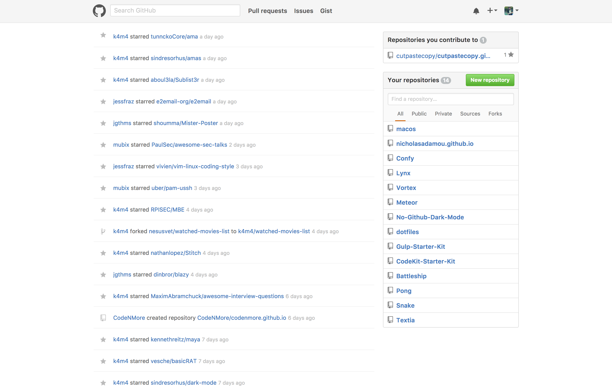

No GitHub Dark Mode
--------------------------------------------------------------------------------

 | 
--------------------------------------------------------------------------------------------- | -----------------------------------------------------------------------------------------------
Before the extension                                                                          | After the extension

-------

Install:
-------

1. Download the `zip` here: [No-GitHub-Dark-Mode.zip](https://github.com/nicholasadamou/No-Github-Dark-Mode/releases/download/v0.0.1/No-Github-Dark-Mode.zip)
2. Extract it
3. Go to chrome `Settings`, then `Extensions`
4. Enable Developer Mode
5. Click `load unpacked extension`
6. Select the extracted `No-Dark-Mode\` Folder

License
-------

No-Github-Dark-Mode is © 2017 Nicholas Adamou.

It is free software, and may be redistributed under the terms specified in the [LICENSE] file.

[LICENSE]: LICENSE
